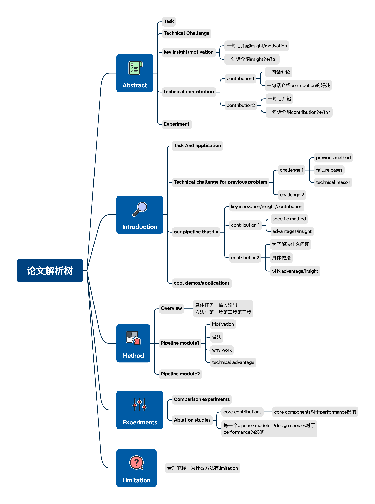
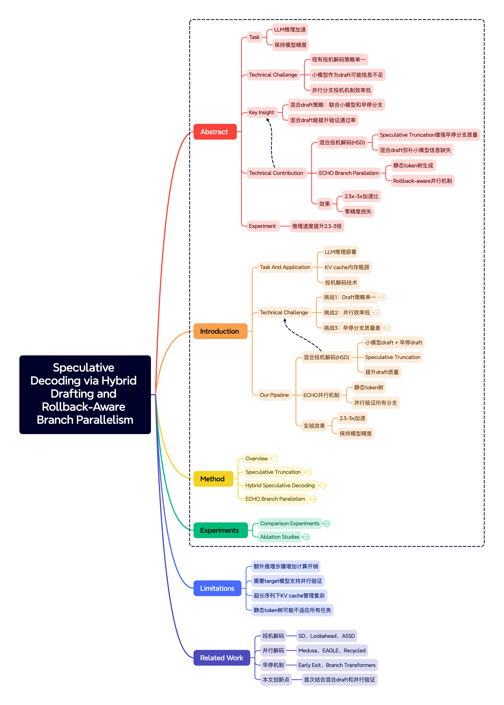
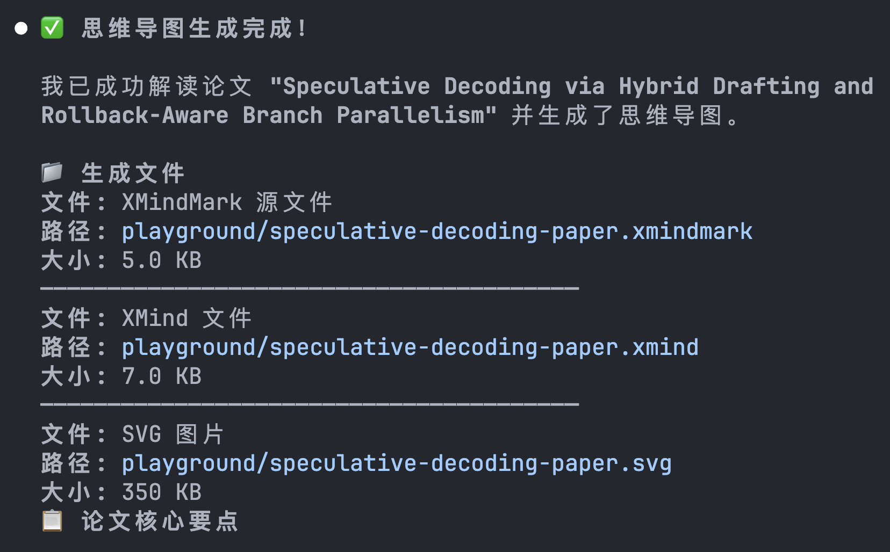

# XMindify MCP

XMind 思维导图 MCP 服务器，支持可视化创建和编辑思维导图，可部署到 Cloudflare Workers。

## 快速开始

### 安装依赖

```bash
pnpm install
```

### 本地开发

```bash
# 构建 UI 资源
pnpm run build

# 启动开发服务器
pnpm run dev
```

访问 http://localhost:8787/mcp

### 部署到 Cloudflare

```bash
# 构建并部署
pnpm run deploy
```

## MCP 工具

| 工具 | 功能 |
|------|------|
| `read_me` | 返回 XMindMark 语法规范和示例 |
| `create_view` | 根据 XMindMark 创建思维导图视图 |
| `update_view` | 更新当前思维导图内容 |
| `export_to_xmind` | 导出为 XMind 二进制文件 |
| `set_zoom` | 设置查看器缩放级别 |

## XMindMark 语法示例

```
中心主题

- 主分支1
    * 子分支1.1
    * 子分支1.2 [B]
- 主分支2 [^1](关联说明)
```

更多语法请调用 `read_me` 工具查看。

---

# XMindify Skills

A skill that can automatically generate mind maps in different scenarios with respect to .xmind syntax

## Demo

论文解析树



论文解析案例 - 以一篇论文为例



Claude Code 截图



## Quick Start

### 1. 安装 XMindMark CLI

```bash
pnpm install -g xmindmark
```

或从源码安装：

```bash
git clone https://github.com/xmindltd/xmindmark.git
cd xmindmark
pnpm install
pnpm run build
pnpm link
```

### 2. 安装 Skill

将此 skill 目录添加到你的 Claude Code skills 目录：

全局安装

```bash
cd xmindify
cp -r .claude/skills/xmindify ~/.claude/skills/
claude
```

项目安装

```bash
cd xmindify
claude
```

## 场景模板

| 场景 | 说明 | 触发关键词 |
|------|------|-----------|
| [论文阅读](scenarios/paper.md) | 学术论文结构化分析 | 论文、学术、research |
| [内容总结](scenarios/summary.md) | 长篇内容要点提炼 | 总结、提炼、梳理 |
| [头脑风暴](scenarios/brainstorm.md) | 创意构思与发散思维 | 头脑风暴、创意、方案 |
| [问题分析](scenarios/analysis.md) | 问题根因与方案决策 | 分析、问题、决策 |
| [项目规划](scenarios/project.md) | 项目计划与任务分解 | 项目、计划、roadmap |

## 依赖

- [xmindmark](https://github.com/xmindltd/xmindmark) - XMindMark CLI 工具
- [Claude Code](https://claude.ai/code) - Anthropic 的 AI 编程助手
- [learning_research](https://github.com/pengsida/learning_research/tree/master) 中彭思达老师讲的论文解析树

## 许可证

MIT License - 详见 [LICENSE](LICENSE)
